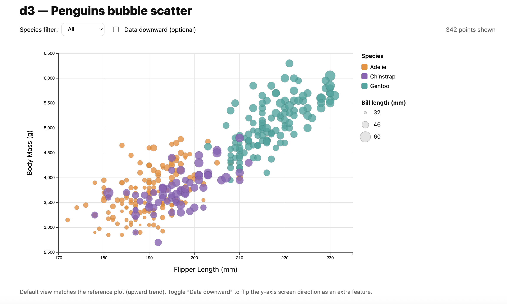
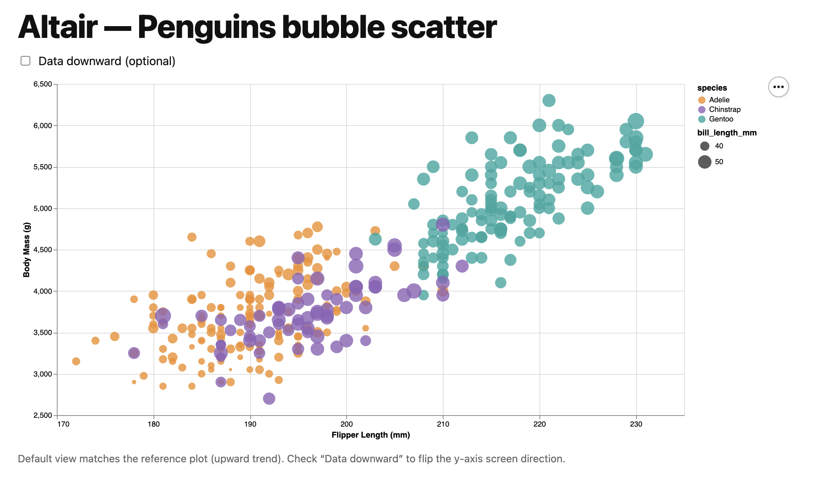
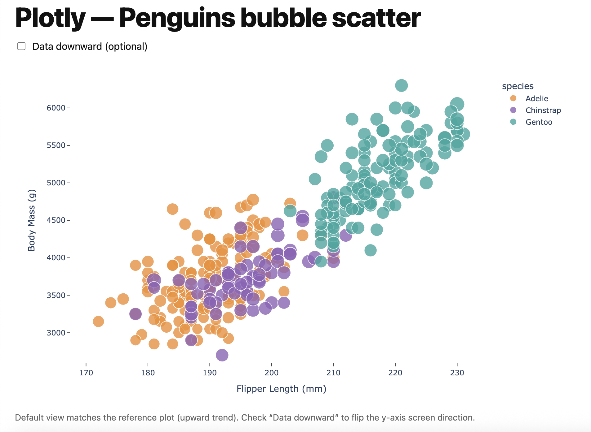

# Assignment 2 — Data Visualization, 5 Ways (Penguins)

This repo contains **five replications of the same penguin scatterplot** using **3 libraries (code)** and **2 tools (no-code)**, based on `penglings.csv`.

Target plot features preserved as much as possible across tools:

- **Data positioning:** upward-trending scatterplot (matches the reference)
  - X = **Flipper Length (mm)**
  - Y = **Body Mass (g)**
- **Scales do not start at 0**
- **Axis ticks + labels**
- **Color = species**
- **Size = bill_length_mm**
- **Opacity ≈ 0.8**

**Note on “data downward”:** the rubric mentions “data downward,” but the assignment directions also require matching the **upward-trending reference**.  
To satisfy both, the coded charts include an **optional “Data downward” checkbox** (default view matches the reference). Excel and Datawrapper do not include this toggle.

---

## Quick links (local server)

If you run a local server from the repo root (example below), you can open each version at:

- **d3:** `http://localhost:8000/d3/`
- **Altair:** `http://localhost:8000/python-altair/altair.html`
- **Plotly:** `http://localhost:8000/python-plotly/plotly.html`

---

## Tool link (Datawrapper)

- **Datawrapper public chart:** https://datawrapper.dwcdn.net/8VNpp/1/

---

## Repo structure

- `d3/` — d3.js version (library)
- `python-altair/` — Altair + Vega-Lite version (library)
- `python-plotly/` — Plotly version (library)
- `excel/` — Excel version (tool)
- `datawrapper/` — Datawrapper version (tool)
- `img/` — screenshots used in this README
- `penglings.csv` — dataset (repo root)

---

## How to run / view locally

### Start a local web server (from repo root)

```bash
python3 -m http.server 8000

Then open:
- http://localhost:8000/d3/
- http://localhost:8000/python-altair/altair.html
- http://localhost:8000/python-plotly/plotly.html

> You can also open the HTML files directly, but a local server keeps paths consistent (especially if anything loads assets).

---

## d3

**Local link:** http://localhost:8000/d3/



**Reflection:**  
The d3 version gave me the most direct control over scales, axes, legends, and interaction. The main challenge was handling **asynchronous CSV loading** and ensuring the visualization only renders after cleaning/filtering the data. d3 is ideal when you want full customization (tooltips, filters, custom legends), but it requires more code than “tool” workflows.

**Limitations / deviations:**  
- Default view matches the reference (upward trend).  
- Includes an optional **Data downward** checkbox (off by default).

---

## Altair (Vega-Lite)

**Local link:** http://localhost:8000/python-altair/altair.html



**Reflection:**  
Altair made it quick to reproduce the chart once the encodings were set. Tooltips and export come naturally through Vega/Vega-Lite, which makes it good for fast iteration. The key adjustment was matching bubble sizing, since Altair’s `size` channel represents **area**, not radius—so I tuned the size scale to visually match the reference/d3.

**Limitations / deviations:**  
- Default view matches the reference (upward trend).  
- Includes an optional **Data downward** checkbox (off by default).

---

## Plotly

**Local link:** http://localhost:8000/python-plotly/plotly.html



**Reflection:**  
Plotly is convenient for quickly generating an interactive scatter plot with hover, pan, and zoom. Matching the reference required tuning marker sizing because Plotly scales marker size differently than d3. I kept a consistent category order and palette across tools and added a checkbox in the wrapper HTML to optionally flip the y-axis screen direction.

**Limitations / deviations:**  
- Default view matches the reference (upward trend).  
- Includes an optional **Data downward** checkbox (off by default).

---

## Excel

**Files:**
- `excel/excel_penguins.xlsx`
- `excel/excel_penguins.png`


**Reflection:**  
Excel was fast for building a chart, but it required more manual setup to match the reference. Color mapping by species meant creating separate series (one per species), and bubble sizing needed manual scaling (bubble scale %) to avoid oversized markers. Excel is useful for quick exploratory visuals or sharing with non-programmers, but it’s less reproducible than code-based approaches.

**Limitations / deviations:**  
- Matches the reference (upward trend).  
- **No “Data downward” toggle** implemented in a clean/portable way.  
- Some formatting (opacity and bubble scaling) is easiest through the Excel UI.

---

## Datawrapper

**Public link:** https://datawrapper.dwcdn.net/8VNpp/1/

**Files:**
- `datawrapper/datawrapper.png`
- `datawrapper/link.txt` (contains the public URL)


**Reflection:**  
Datawrapper was the quickest way to produce a polished chart and export a PNG. It’s great for publishing and fast iteration, but it offers less control than code libraries for fine-grained behavior. Reproducibility also depends on the published URL rather than running local code.

**Limitations / deviations:**  
- Matches the reference (upward trend).  
- **No “Data downward” toggle** implemented.

---

## Technical Achievements

- **Five distinct tools total (3 libraries + 2 tools):**
  - Libraries: d3, Altair, Plotly
  - Tools: Excel, Datawrapper
- **Cross-tool consistency:** preserved the same core encodings everywhere:
  - X = flipper length, Y = body mass
  - color = species, size = bill length
  - opacity ≈ 0.8
  - axis domains set from data (not forced to 0)
- **Interactivity (coded versions):**
  - d3: hover tooltip + filtering/legend toggles + optional “Data downward” checkbox
  - Altair: interactive tooltips + optional “Data downward” checkbox in HTML wrapper
  - Plotly: interactive tooltips + optional “Data downward” checkbox in HTML wrapper
- **Reproducibility:** code versions read `penglings.csv` and generate viewable HTML outputs.

---

## Design Achievements

- **Consistent categorical palette across tools** (same species mapping):
  - Adelie: `#F28E2B`
  - Chinstrap: `#8F63B8`
  - Gentoo: `#2CA7A0`
- **Reference-matching choices:**
  - non-zero axis domains
  - readable tick density
  - semi-transparent points to reduce overplotting
  - bubble size tuned to visually match the reference (ggplot-style) as closely as possible
- **Readable labeling:** consistent axis labels + legend titles.

---

## Submission

- **Pull Request:** 